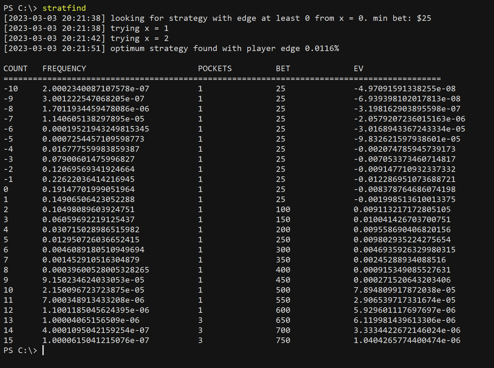
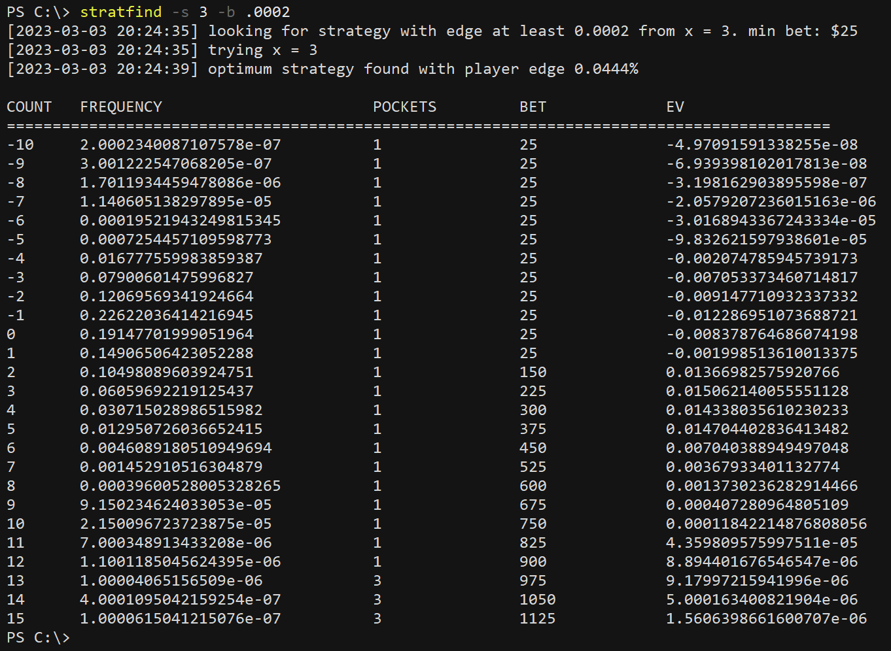

# blackjack

In this repo are scripts to help with formulating a card counting strategy for Blackjack.<br>
* blackjack.py--runs simulations of the game
* stratfind.py--finds a betting strategy with positive expected value, if one exists

<hr />

## Summary

It is well-known that Blackjack can be beaten with card counting. It is also thought that continuous shuffling machines (CSMs) impede card counting by making forthcoming cards unpredictable. However, it turns out that CSMs have a mechanical feature that allows for some (albeit limited) degree of card counting. We show, using this collection of scripts, that the allowed extent of card counting is exploitable to give the player a positive edge over the house. Blackjack.py simulates Blackjack games at a rate of about 6 million rounds per hour, which allows us to test the long term results of various cardplay strategies. Stratfind.py uses an approximate brute-force algorithm to find a betting strategy that gives the player a positive edge. Using both scripts, we found an overall strategy with a theoretical edge of 0.05% in favour of the player, which materialised as a ??% profit in an experiment of 10 million rounds.

<hr />

## blackjack.py

In its default setting, blackjack.py simulates a single round of Blackjack according to the rules [here](https://www.cra.gov.sg/docs/default-source/game-rule-documents/mbs-blackjack-v6.pdf). The simulated player opens 5 pockets with bets of $25 on each, and follows basic strategy. To see the simulated player's decisions in action, run

```blackjack -V```


Run blackjack.py with the -h option to see other available options for overriding the script's default behaviour:


By simulation, we can verify that basic strategy alone is insufficient to give the player a favourable edge. The following command runs a simulation of 5 million rounds under basic strategy:

```blackjack -n 5M```


The results of the simulation come close to known values from [publicly available sources](https://wizardofodds.com/games/blackjack/calculator/).


In what follows, our goal is to formulate a strategy that gives the player a favourable edge.

<hr />

## Card-counting theory

A popular method for beating Blackjack involves _card counting_, in which a player keeps track of cards that are dealt so they can infer that forthcoming cards are more likely to be in their favour. More precisely, the count at any point is the number of high cards (10 to A) that have been dealt subtracted from the number of low cards (2 to 6) that have been dealt. A high (low) count indicates that forthcoming cards are likely to be high (low), which favours the player (house). Card counting is often used in conjunction with a betting strategy in which the player bets conservatively at low counts and aggressively at high counts, such that the player has an positive overall edge.

The card-counting strategy works best when cards played are not shuffled back into the deck, so that the count reliably reflects the value of forthcoming cards. Continuous shuffling machines falsify this condition by allowing the dealer to shuffle, at the end of each round, the cards dealt in that round back into the deck. In theory, this would prevent card counting, since it seems to entail that likelihood of high cards being dealt in any round is independent of the cards played in the previous round. In practice, however, CSMs smoothen dealing by maintaining a small _buffer_ of cards that are not shuffled when cards are fed into the CSM. The count in a given round is thus a reliable guide to the likelihood of high cards coming from that buffer. It turns out that this degree of card counting, despite being extremely limited compared to the traditional method, is sufficient to formulate a strategy that gives the player a favourable edge.

In its default setting, blackjack.py implements a CSM containing 6 decks and with a 7-card buffer, which appears to match the specifications of the CSM used in the casino at Marina Bay Sands. These parameters can be overridden with the -D and -B options.

<hr />

## Betting strategy

To formulate a betting strategy, we require to know how the house edge varies with the count. In addition, it turns out that for CSMs with a small buffer, the house edge also depends on the number of pockets played (since a larger number of pockets runs out the buffer more quickly, increasing the proportion of cards in a round not indicated by the count). Using blackjack.py, we ran simulations of 5 million rounds at each number of pockets from 1-5, and each count value from -10 to +15. For example, the following command runs, for each of the 26 possible count values from -10 to +15, a simulation of 5M rounds with 1 pocket each, resetting the deck to the target count value after each round:

```blackjack -n 5M -p 1 -c A```

The per-count estimated house edges are as follows:

|Count|1 pocket|2 pockets|3 pockets|4 pockets|5 pockets|
|---|---|---|---|---|---|
|-10|0.00994066872522887|0.00906049815895536|0.010903819496784251|0.0075887719921748625|0.005945398695516308|
|-9|0.009248761787154614|0.00856781205314523|0.010562591168740313|0.007459361678027633|0.005707865374122695|
|-8|0.007519810075717198|0.008257848362206758|0.009169675290686196|0.007196399788861663|0.005271171383003548|
|-7|0.007216943548658794|0.008134476813796983|0.008202246690143983|0.007081912444638871|0.0049926208769952955|
|-6|0.0061815451425469535|0.007069331516574062|0.007616956617500854|0.006140640662547221|0.004904273599678865|
|-5|0.005421561641010196|0.005871703809407495|0.006814811930572097|0.006073564690198731|0.004713350958876891|
|-4|0.0049465737514518|0.0057817128813427866|0.006717191623118072|0.005807983760576887|0.004531767357204793|
|-3|0.0035710564478636155|0.004498892580040326|0.006662122285136016|0.005032568519194796|0.004371769331504996|
|-2|0.003031661088540082|0.004416758420209416|0.004797083050487015|0.004553492203483922|0.004294915325194144|
|-1|0.002172563220872002|0.0035747599889965377|0.004657037831580172|0.004227939220030406|0.004236452407689186|
|0|0.0017503436572156898|0.0032839682276973184|0.0036253790728193393|0.0038995787440876165|0.00400819823727895|
|1|0.0005362795421797175|0.0025679191477510897|0.003276305688272843|0.0036428361128320614|0.0037918027341684378|
|2|-0.0008680833862761178|0.0019455443027193617|0.002589567869970672|0.003600379064029687|0.003708898109675021|
|3|-0.0011047235118650934|0.0011329010242400518|0.0024678402127659193|0.003229489903832785|0.0036678847496487135|
|4|-0.0015560282249800998|0.0006655745397941576|0.0017725405476669174|0.0028599562805691264|0.0036493602757631345|
|5|-0.003027763909616168|0.00036846913084130064|0.0014747360764874424|0.0026432391646220212|0.003627666104594382|
|6|-0.0033945730002604736|-0.00027988145165558343|0.0008062051460985028|0.0026154935073989015|0.0035636522161200147|
|7|-0.004823597311068861|-0.0008700420107552072|0.0007757728067916418|0.0016354904158950463|0.0035416399765091804|
|8|-0.005778641924954072|-0.00113920002581661|-0.0007971414315791877|0.0017142566308130077|0.003409873699951947|
|9|-0.00659413918779642|-0.0018242902771010805|-0.0010902929803202456|0.0014400698055744429|0.00314851344032793|
|10|-0.007343678850129651|-0.0020363829321124248|-0.0014974100153926297|0.000988551736913766|0.002993111193396823|
|11|-0.007549077529171351|-0.003339783934296084|-0.00225965135183103|0.0009359721417203494|0.0029698237857178|
|12|-0.008983276336604201|-0.0038168307418231144|-0.0027988747917354908|0.000926955420306853|0.002769250976507185|
|13|-0.009368139824911553|-0.004484249231865061|-0.003138324442514168|0.0006466574384574554|0.002751618080345252|
|14|-0.010811942849545512|-0.004820875681446687|-0.003968275015734912|0.0001962330023582169|0.0024224655014291096|
|15|-0.010899512332873545|-0.005464019614031691|-0.0046238337371237665|4.56376668738817e-05|0.002160186894884765|

In contrast to the legacy shuffling system, in which the house edge at a count is independent of the number of pockets played, we observe that with a CSM, some count admit player-favourable edges at low pocket numbers but not high pocket numbers. This phenomenon is expected, for reasons given above, and must be accounted for because it limits how aggressive a betting strategy can be in terms of the number of pockets it plays.

Besides affecting the house edge in the present round, the number of pockets played also indirectly affects the house edge in the next round, because playing a larger number of pockets in one round increases the probability that a more extreme-valued count would obtain in the next round. To account for this, we seek to know the _transition probabilities_ from number of pockets to counts. That is, for each number of pockets from 1-5, we seek the probability that a round played with that number of pockets will end in a particular count value. (We assume for now that the cardplay strategy does not change with the count, so that the starting count value is unimportant. This assumption will become false later, but should not affect the results here too much.) The following command runs a simulation of 10 million rounds with 1 pocket each, reporting the proportion of rounds that end in each count from -10 to +15

```blackjack -p 1 -n 10M -T```

The following are the estimated transition probabilities:

|Count|1 pocket|2 pockets|3 pockets|4 pockets|5 pockets|
|---|---|---|---|---|---|
|-10|2e-07|0.0|1.58e-05|0.0001776|0.0009538|
|-9|3e-07|3.4e-06|8.18e-05|0.0008499|0.0024454|
|-8|1.7e-06|5.76e-05|0.0007973|0.0032678|0.0063846|
|-7|1.14e-05|0.000293|0.0040455|0.0092099|0.0139132|
|-6|0.0001952|0.0039209|0.0131497|0.0206081|0.0261724|
|-5|0.0007254|0.0182804|0.0311982|0.0384534|0.0431496|
|-4|0.0167775|0.045782|0.0567652|0.0615574|0.0634234|
|-3|0.079006|0.0903064|0.0888456|0.0868345|0.0842732|
|-2|0.1206957|0.124291|0.1163087|0.108519|0.1020525|
|-1|0.2262205|0.1588589|0.1356521|0.1222394|0.1126316|
|0|0.1914771|0.158095|0.1381395|0.1245056|0.1145413|
|1|0.1490651|0.1375766|0.1252197|0.1152134|0.1075097|
|2|0.1049809|0.1063467|0.1023405|0.0976128|0.0930583|
|3|0.0605969|0.0720696|0.0753905|0.0756748|0.0749966|
|4|0.030715|0.0431561|0.0500386|0.0540491|0.0561677|
|5|0.0129507|0.0229132|0.0303078|0.0356448|0.0390919|
|6|0.0046089|0.0108602|0.0166425|0.0214998|0.0254701|
|7|0.0014529|0.0045697|0.0084635|0.0121712|0.0156032|
|8|0.000396|0.0017515|0.0039159|0.0063813|0.0089571|
|9|9.15e-05|0.0006037|0.0016556|0.003105|0.0047748|
|10|2.15e-05|0.0001852|0.0006663|0.0014213|0.0024133|
|11|7e-06|5.44e-05|0.0002396|0.0006123|0.0011521|
|12|1.1e-06|1.71e-05|8.01e-05|0.000248|0.0005048|
|13|1e-06|4.9e-06|2.81e-05|9.17e-05|0.0002179|
|14|4e-07|1.6e-06|7.7e-06|3.4e-05|9.23e-05|
|15|1e-07|9e-07|4.2e-06|1.79e-05|4.92e-05|

Using these data, we can formulate a favourable betting strategy with stratfind.py. The script takes as input two matrices containing the per-count edges and transition probabilities, and runs an approximate brute-force algorithm to find a betting strategy that gives the player an edge above a specified threshold. The strategy to be identified has the following form<br>
(i) if at a particular count, the player does not have positive edge at any number of pockets, bet the minimum and play a number of pockets to be determined between 1-5<br>
(ii) if at a particular count, the player can attain positive edge for some number of pockets, play the number of pockets that maximises the player's edge and bet x*minimum*c, where c is the count and x is a natural number to be determined.<br>
This betting strategy follows the typical pattern for card-counting strategies: conservative at unfavourable counts and aggressive at favourable counts. 

In its default setting, stratfind takes the minimum to be $25, searches upward from x=1 without limit, and seeks a strategy with positive edge. These can be overridden with command-line options


Given the matrices above, a full brute-force search would take considerable time (5^12 > 200M trials for each value of x). Stratfind.py in its default setting thus does only an approximate brute-force search in which the number of pockets at odd-valued counts are assumed to be identical to those at the immediately-lower count--this can be overridden with the -F option. The approximation reduces the search space to 15625 trials at each value of x, which can be performed in below 5 seconds. Running `stratfind` without options begins the search:



Stratfind finds that a positive edge of 0.0116% is possible at x=2. Given the wide possible variation in results, we might seek a slightly more robust edge. The following command runs a brute-force search beginning at x=3 and sets the threshold to 0.02%:

```stratfind -s 3 -b .0002```



A strategy of edge 0.0444% is possible at x=3. Given the uniformity of pocket numbers from counts -10 to +1, a full brute force search seems unnecessary. Our betting strategy is hence as follows:
- at counts +12 and below, play 1 pocket; at counts +13 and above, play 3 pockets
- at counts +1 and below, bet $25; at counts +2 and above, bet $75*count

Running blackjack.py with the -S option implements this betting strategy. A simulation of 5 million rounds confirms that we've found a betting strategy with player-favourable edge:

```blackjack -n 5M -S```


<hr />

## Cardplay strategy
We seek to improve our edge further by implementing a count-sensitive cardplay strategy. Presumably, basic strategy represents the optimal count-insensitive strategy, hence we assume that our desired strategy would largely resemble basic strategy save a few deviations that obtain at certain count values. We will test the possible profitabily of the following deviations from basic strategy:
- split: 10s against 2-9, 10s against 2, 10s against 9, 9s against 7, As against A
- double on: hard 10/11 against 10, hard 9 against 2-9, hard 12 against 2-9, soft 17/18 against 2, soft 17/18 against 7, soft 13/14 against 4, soft 13/14 against 7, soft 19 against 3-6
- surrender on: hard 13 against 10, hard 14/15 against 9, hard 16 against 8, hard 17 against 9/10
- don't split: As against 10, 8s against 9
- don't surrender on hard 14

Given the large number of possible deviations, it seemed impractical to run large numbers of simulations for each count value for each possible deviation. To narrow in on a shortlist of viable deviations, we first ran smaller simulations of 3 million rounds at counts -10, 0, and +15 for each possible deviation (under the above betting strategy). The following command runs such a test:

```blackjack -S -n 3M -c B -d```

The observed house edges are as follows:

|Deviation|-10|0|+15|
|---|---|---|---|
|Baseline|0.00844066872522887|0.0002503436572156898|-0.0061238337371237665|
|Split 10 against 2-9|0.013291908320854213|0.005599867417652645|-0.0008497423705041022|
|Split 10 against 2|0.009530636311391599|0.0011388145589275008|-0.005635645438571812|
|Split 10 against 9|0.009497115787199983|0.0011595819239482534|-0.003299006574022928|
|Split 9 against 7|0.008968004445809004|0.00004165253366838492|-0.005217902365448402|
|Split A against A|0.009234368239258111|-0.0005092892628557069|-0.005954250808266156|

Based on this rough estimate, the viable deviations are:
...
The other possible deviations did not show significant improvements from basic strategy at either low, high, or middling counts, and thus did not warrant further investigation. We did more thorough tests of the shortlisted viable deviations, running simulations of 5 million rounds at each count from -10 to 15. The following command runs the test

```blackjack -S -n 5M -c A -d```

The per-count edges for each viable deviation are as follows:

|Count|Baseline|...|
|---|---|---|
|-10|0.00994066872522887|
|-9|0.009248761787154614|
|-8|0.007519810075717198|
|-7|0.007216943548658794|
|-6|0.0061815451425469535|
|-5|0.005421561641010196|
|-4|0.0049465737514518|
|-3|0.0035710564478636155|
|-2|0.003031661088540082|
|-1|0.002172563220872002|
|0|0.0017503436572156898|
|1|0.0005362795421797175|
|2|-0.0008680833862761178|
|3|-0.0011047235118650934|
|4|-0.0015560282249800998|
|5|-0.003027763909616168|
|6|-0.0033945730002604736|
|7|-0.004823597311068861|
|8|-0.005778641924954072|
|9|-0.00659413918779642|
|10|-0.007343678850129651|
|11|-0.007549077529171351|
|12|-0.008983276336604201|
|13|-0.003138324442514168|
|14|-0.003968275015734912|
|15|-0.0046238337371237665|

<hr />

## Validation
